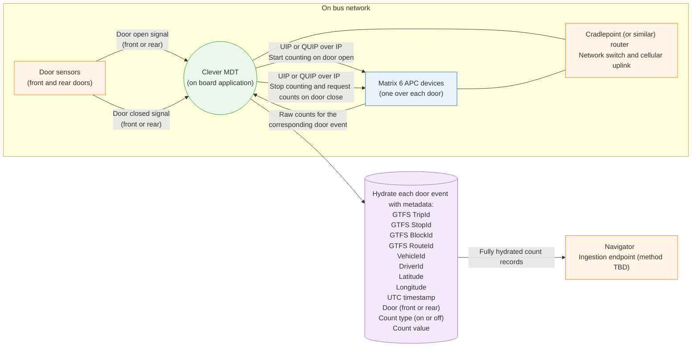

# Technical Workflow Description

## 1. System Architecture On the Bus
Each bus contains:

- **MATRIX APC devices**, one installed above each passenger door.
- A **Cradlepoint (or similar) router** that provides LAN connectivity between all onboard systems and a cellular uplink.
- A **Clever MDT application** connected to the same router.
- **Door sensors** that report open and closed states for each door to the Clever MDT.

Both the Clever MDT and all MATRIX devices communicate using IP networking through the onboard router. UDP or TCP is used depending on the UIP or QUIP protocol requirements.

---

## 2. Door State Detection and Event Handling

### Door Opens
1. A door sensor transitions to **open**.
2. The Clever MDT receives this door-open signal and identifies which door triggered the event (front or rear).
3. The Clever MDT sends a **Start Counting** command to the corresponding MATRIX device using the UIP or QUIP protocol over the bus network.
4. The MATRIX device begins collecting raw counting data for that door, capturing passenger movements while the door remains open.

### Door Closes
1. The door sensor reports a **closed** state.
2. Clever MDT receives this update.
3. Clever MDT sends a **Stop Counting** command to the matching MATRIX device.
4. Clever MDT issues a **Report Counts** request.
5. The MATRIX device returns structured count totals representing the on and off movements detected during the door-open interval.

---

## 3. Count Hydration in the Clever MDT

After receiving raw counts from the MATRIX device, the Clever MDT attaches operational and positional metadata.

Each count record is hydrated with:

- GTFS TripId  
- GTFS StopId  
- GTFS BlockId  
- GTFS RouteId  
- VehicleId  
- DriverId  
- Latitude  
- Longitude  
- UTC timestamp  
- Door (front or rear)  
- Count type (on or off)  
- Count value  

The Clever MDT accesses GTFS context from Clever back-office feeds or cached onboard configuration.  
GPS data is obtained from the onboard CAD/AVL location source.

---

## 4. Transmission to the Backend (Navigator)

1. Clever MDT batches hydrated count records or prepares them for near real time upload.
2. Clever MDT connects to Navigator using the integration method that will be defined later (HTTPS, MQTT, gRPC, etc).
3. Clever MDT uploads the hydrated APC events.
4. Navigator receives and stores these records for downstream reporting or external API distribution.

---

## 5. Summary of Technical Flow

- Door sensors notify Clever MDT of open and closed events.
- Clever MDT controls MATRIX APC devices via UIP or QUIP messages over IP through the onboard router.
- MATRIX devices provide raw counts at the end of each door-open event through a **Report Counts** request.
- Clever MDT hydrates these counts with operational, spatial, and temporal metadata.
- Hydrated APC records are transmitted to Navigator for ingestion and use by analytics platforms or external consumers.

## Diagram

